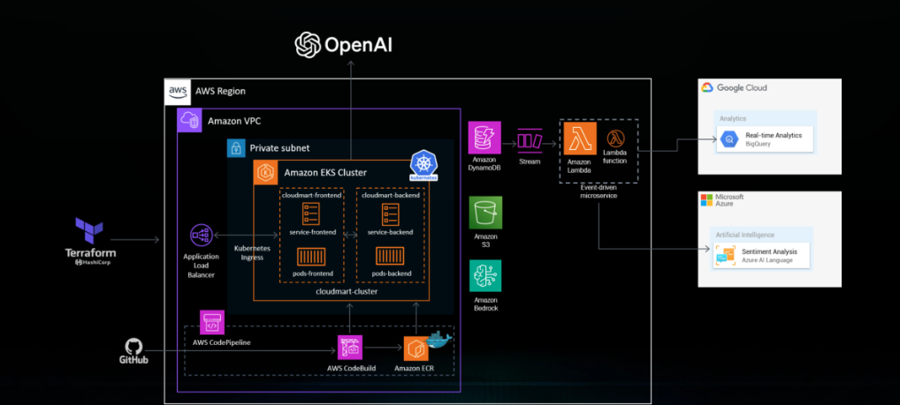

# E-commerce Project

## Overview
Este projeto é um e-commerce hospedado na AWS, utilizando diversos serviços e ferramentas para garantir escalabilidade, segurança e eficiência. O projeto foi implementado com as seguintes tecnologias:

- **React**: Utilizado no frontend para uma experiência de usuário interativa e responsiva.
- **Node.js**: Utilizado no backend para a lógica do servidor e manipulação de APIs.
- **AWS**: Utilizado para hospedar a aplicação, garantir a segurança e escalabilidade.
- **Terraform**: Utilizado para a infraestrutura como código (IaC), permitindo a provisão e gerenciamento dos recursos da AWS.
- **Docker**: Utilizado para a containerização da aplicação, garantindo um ambiente consistente de desenvolvimento e produção.
- **Kubernetes (K8s)**: Utilizado para orquestrar os contêineres Docker, garantindo alta disponibilidade e escalabilidade.
- **CI/CD Pipelines**: Implementado para garantir integração e entrega contínuas, automatizando o processo de deploy.

## Tecnologias Utilizadas
- **Frontend**: React, HTML, CSS
- **Backend**: Node.js, Express
- **Infraestrutura**: AWS (S3, EC2, EKS, DynamoDB, etc.), Terraform
- **Containerização**: Docker
- **Orquestração**: Kubernetes
- **CI/CD**: GitHub, AWS CodePipeline, AWS CodeBuild

## Arquitetura
Aqui está um diagrama da arquitetura do projeto:

## Descrição dos Serviços AWS
- **EC2**: Para hospedar os servidores da aplicação.
- **S3**: Para armazenamento de arquivos estáticos e imagens.
- **EKS**: Para gerenciar clusters de contêineres Kubernetes.
- **ECR**: Para armazenar imagens de contêineres Docker.
- **DynamoDB**: Para banco de dados NoSQL.
- **CodePipeline**: Para orquestrar o processo de CI/CD.
- **CodeBuild**: Para compilar e testar o código durante o processo de CI/CD.

## Créditos
Este projeto foi desenvolvido com o apoio e orientação do [The Cloud Bootcamp](https://thecloudbootcamp.com/pt/). Agradecemos pelo excelente curso e pelo suporte durante toda a implementação.

## Contato
Para mais informações, entre em contato via [LinkedIn](https://www.linkedin.com/in/walax-azevedo-brandao-2483a6212/).

